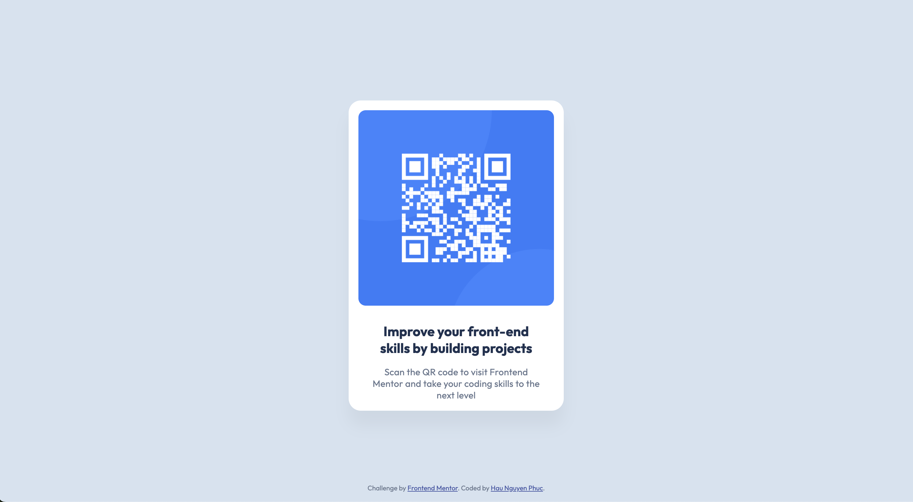

# QR Code Component

## Overview

This project is a solution to the [Frontend Mentor QR code component challenge](https://www.frontendmentor.io/challenges/qr-code-component-iux_sIO_H). The goal was to build a responsive QR code card using only HTML and CSS.

## Features

- Responsive card layout
- Custom font (Outfit)
- Clean, modern design matching the provided JPGs
- Accessible image alt text

## Built With

- HTML5
- CSS3

## How to Use

1. Clone this repo.
2. Open `index.html` in your browser.

## Screenshot

## Author

- Website - [Hau Nguyen](https://github.com/haunguyenphuc1110)
- Frontend Mentor - [@haunguyenphuc1110](https://www.frontendmentor.io/profile/haunguyenphuc1110)

## Acknowledgments

- [Frontend Mentor](https://www.frontendmentor.io) for the challenge and assets.
